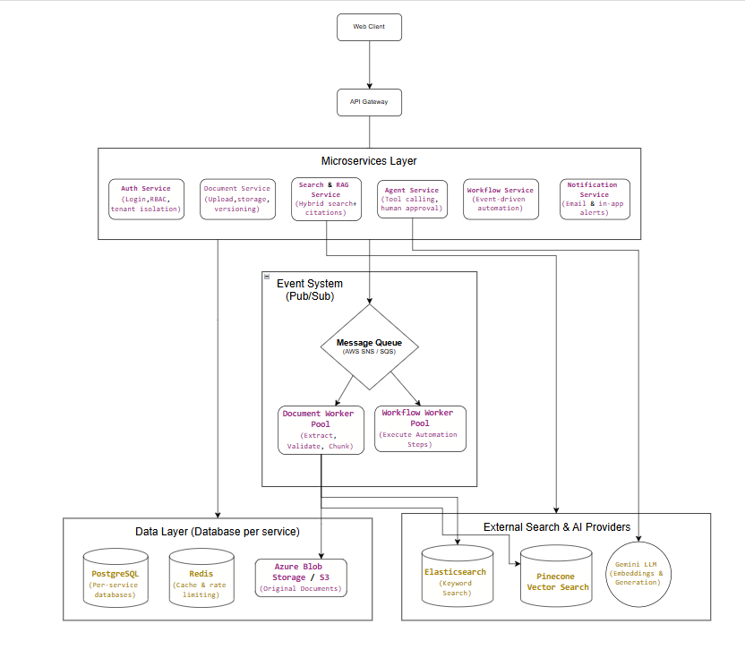

# Cortex — Enterprise AI Knowledge Automation Platform

A multi-tenant, event-driven microservices platform that lets organizations securely upload, search, and query internal documents using AI/RAG, with autonomous agents that can take controlled actions on top of that knowledge.

---

## Table of Contents

- [Overview](#overview)
- [Architecture](#architecture)
- [Services](#services)
- [Tech Stack](#tech-stack)
- [Core Features](#core-features)
- [Data Flow](#data-flow)
- [Getting Started](#getting-started)
- [Environment Variables](#environment-variables)
- [Project Structure](#project-structure)
- [Roadmap](#roadmap)
- [License](#license)

---

## Overview

Cortex ingests enterprise documents (PDF, DOCX, CSV, etc.), processes them asynchronously into a searchable knowledge base, and exposes that knowledge through:

- **Hybrid search & RAG** — keyword (Elasticsearch) + semantic (Pinecone) retrieval, combined and passed to an LLM (Gemini) for cited, context-grounded answers.
- **AI agents** — tool-calling agents that can search documents, create tasks, and generate reports, with human-in-the-loop approval for sensitive actions.
- **Workflow automation** — event-driven pipelines (e.g. `Document Uploaded → Analyze → Detect Risk → Create Task → Notify`).
- **Multi-tenant security** — every request is scoped by organization, role, and document-level permissions before it ever reaches the LLM.

The system is built as independently deployable microservices communicating over an event bus, rather than a single monolithic backend, so each service can scale, deploy, and fail independently.

---

## Architecture


---

## Services

| Service | Responsibility |
|---|---|
| **Auth Service** | Login, RBAC, tenant isolation |
| **Document Service** | Upload, storage, metadata, versioning |
| **Search & RAG Service** | Hybrid search orchestration, citation-backed answers |
| **Agent Service** | Tool-calling agents, human-in-the-loop approval |
| **Workflow Service** | Event-driven multi-step automation |
| **Notification Service** | Email & in-app alerts |
| **Document Worker Pool** | Extracts, validates, chunks, and indexes documents (queue-driven) |
| **Workflow Worker Pool** | Executes automation steps triggered by events |

Each service owns its own data — there is no shared database — and services communicate asynchronously through the event system rather than direct in-process calls.

---

## Tech Stack

- **Backend:** Python, FastAPI
- **Messaging / Event Bus:** AWS SNS + SQS (pub/sub fan-out to per-consumer queues)
- **Databases:** PostgreSQL (per-service), Redis (cache & rate limiting)
- **Object Storage:** AWS S3 / Azure Blob Storage (original documents)
- **Search & AI:** Elasticsearch/OpenSearch (keyword search), Pinecone (vector search), Gemini LLM (embeddings + generation)
- **Infra:** Docker, API Gateway, per-service CI/CD

---

## Core Features

- 🔐 **Multi-tenant, permission-aware retrieval** — documents are filtered by org, role, and access level before being surfaced to search or the LLM.
- 📄 **Async document processing pipeline** — uploads are validated, extracted, chunked, embedded, and indexed by a horizontally scalable worker pool.
- 🔎 **Hybrid RAG search** — combines keyword and vector search results, then generates cited answers via an LLM.
- 🤖 **Controlled AI agents** — agents can call tools (`SearchDocuments`, `CreateTask`, `GenerateReport`) but require human approval before executing sensitive actions.
- ⚙️ **Event-driven workflow automation** — business processes trigger automatically off domain events (e.g. document upload → risk detection → task creation → notification).
- 🛡️ **Resilience patterns** — retries with backoff, dead-letter queues, and idempotency keys to safely handle duplicate/failed message processing across SQS consumers.
- 📊 **Database-per-service** — each microservice owns its own PostgreSQL schema, avoiding hidden coupling between services.

---

## Data Flow

1. User uploads a document via the **Web Client → API Gateway → Document Service**.
2. Document Service stores the file in **S3/Blob Storage** and publishes a `DocumentUploaded` event to **SNS**.
3. SNS fans the event out to SQS queues consumed by the **Document Worker Pool**, which extracts text, chunks it, generates embeddings (Gemini), and indexes it into **Elasticsearch** and **Pinecone**.
4. The same event can also trigger the **Workflow Worker Pool** for downstream automation (e.g. compliance checks, notifications).
5. When a user asks a question, the **Search & RAG Service** queries Elasticsearch + Pinecone, assembles context (filtered by the user's permissions), and calls **Gemini LLM** to generate a cited answer.
6. The **Agent Service** can act on this knowledge — e.g. searching documents and creating a task — but pauses for human approval before executing sensitive actions.

---

## Getting Started

```bash
# Clone the repository
git clone https://github.com/<your-username>/cortex-ai-platform.git
cd cortex-ai-platform

# Copy environment variables
cp .env.example .env

# Start core infrastructure (Postgres, Redis, LocalStack for SNS/SQS)
docker-compose up -d

# Install dependencies for a service (repeat per service)
cd services/document-service
pip install -r requirements.txt

# Run a service locally
uvicorn app.main:app --reload --port 8001
```

> Each service under `services/` can be run and deployed independently. See each service's own `README.md` for service-specific setup.

---

## Environment Variables

| Variable | Description |
|---|---|
| `DATABASE_URL` | PostgreSQL connection string (per service) |
| `REDIS_URL` | Redis connection string |
| `AWS_SNS_TOPIC_ARN` | SNS topic for domain events |
| `AWS_SQS_QUEUE_URL` | SQS queue URL for the consuming service |
| `S3_BUCKET_NAME` | Bucket for original document storage |
| `ELASTICSEARCH_URL` | Elasticsearch/OpenSearch endpoint |
| `PINECONE_API_KEY` | Pinecone vector DB API key |
| `GEMINI_API_KEY` | Gemini LLM API key |
| `JWT_SECRET` | Secret for signing auth tokens |

---
---

## License

This project is licensed under the MIT License — see the [LICENSE](LICENSE) file for details.
